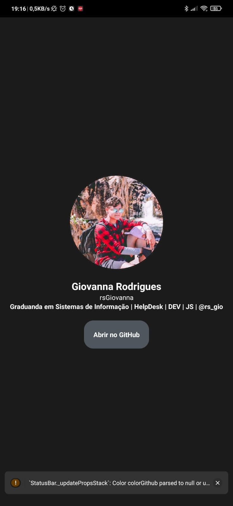

## Primeiro App utilizando RN

O objetivo do projeto é criar um aplicativo que utilize o React Native. Na tela inicial, o usuário poderá visualizar uma breve informação sobre mim, e ao clicar no botão, será encaminhado para o meu GitHub.

## Teste

## Como funciona?

> Por que tenho uma pasta chamada ".expo" em meu projeto?

A pasta ".expo" é criada quando um projeto Expo é iniciado usando o comando "expo start".

> O que os arquivos contêm?

- "devices.json": contém informações sobre dispositivos que abriram recentemente este projeto. Isso é usado para preencher a lista "Sessões de desenvolvimento" em suas compilações de desenvolvimento.
- "packager-info.json": contém números de porta e PIDs de processo que são usados para servir o aplicativo para o dispositivo/simulador móvel.
- "settings.json": contém a configuração do servidor que é usada para servir o manifesto do aplicativo.

> Devo confirmar a pasta ".expo"?

Não, você não deve compartilhar a pasta ".expo". Ele não contém nenhuma informação relevante para outros desenvolvedores que trabalham no projeto, é específico para sua máquina.

Após a criação do projeto, a pasta ".expo" já está adicionada ao seu arquivo ".gitignore".